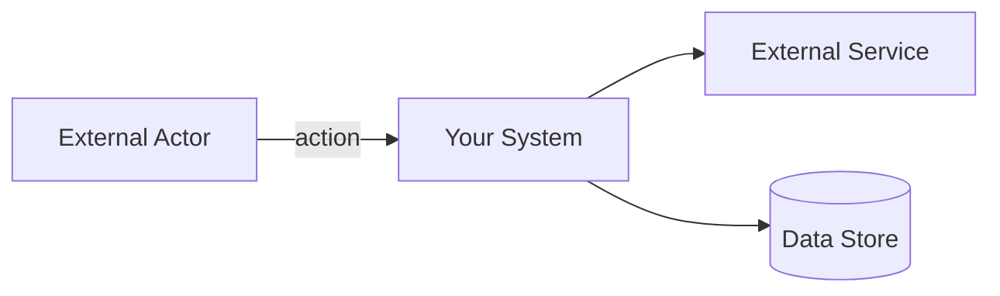

# Architecture-First Protocol

**Status:** Mandatory pre-implementation requirement  
**Enforcement:** No exceptions unless explicitly authorized  
**Last Updated:** March 6, 2026

---

## Core Directive

**AI agents SHALL NOT generate implementation code until conceptual architecture has been designed, diagrammed, and approved.**

Architecture is intentional. Code implements architecture. Never reverse this order.

---

## Execution Sequence

```
Requirements → Architecture → Validation → Implementation
```

**Forbidden:**

```
Requirements → Implementation → Architecture (reverse engineering)
```

---

## Stage 0: Requirements Extraction

Before creating diagrams, extract these critical requirements:

### Essential Questions

1. **Scale & Load**
   - Expected user count? (10 / 10K / 10M)
   - Expected request rate? (req/sec, events/sec)
   - Peak vs average load ratio?

2. **Availability & Reliability**
   - Acceptable downtime? (none / minutes/month / hours/month)
   - Critical paths that cannot fail?
   - Behavior when dependencies unavailable?

3. **Data Requirements**
   - Expected data volume? (MB / GB / TB / PB)
   - Retention requirements?
   - Consistency vs availability preference?

4. **Operational Constraints**
   - Deployment environment? (cloud / on-premise / edge / hybrid)
   - Budget constraints?
   - Team size and expertise?

5. **Integration Requirements**
   - Existing system integrations?
   - Third-party service dependencies?
   - Authentication/authorization model?

**Purpose:** These answers determine system complexity requirements.

---

## Stage 1: System Context (C4 Level 1)

**Purpose:** Define system boundaries and external actors.

### Required Elements

- All human actors (users, admins, operators)
- All external systems (third-party APIs, legacy systems)
- All interfaces (web UI, mobile app, public/internal APIs)
- Information flow at system boundary

### Diagram Format (Mermaid)



### Validation Checklist

- [ ] All user types identified
- [ ] All external dependencies identified
- [ ] System boundary clearly defined
- [ ] Data flow direction clear

---

## Stage 2: Container Diagram (C4 Level 2)

**Purpose:** Define major deployable units and their relationships.

### Required Elements

- Application services (API, web app, worker)
- Data stores (databases, caches, object storage)
- Message infrastructure (queues, event streams)
- Inter-container communication

### Container Decision Guide

| Pattern       | When to Use                                      |
| ------------- | ------------------------------------------------ |
| Monolith      | <10K users, small team, rapid iteration          |
| Microservices | >100K users, multiple teams, independent scaling |
| Serverless    | Variable load, event-driven, minimal ops         |
| Queue/Worker  | Async processing, background jobs, decoupling    |

### Validation Checklist

- [ ] Service boundaries clear
- [ ] Data ownership defined (which service owns which data)
- [ ] Sync vs async flows identified
- [ ] Scaling strategy clear
- [ ] Failure domains isolated

---

## Stage 3: Component Diagram (C4 Level 3)

**Purpose:** Define internal responsibilities within each service.

### Required Elements

- Modules/packages per service
- Component responsibilities
- Dependency direction (must be acyclic)
- Shared libraries

### Component Design Rules

- **Single Responsibility:** Each component has one clear purpose
- **Dependency Direction:** Flow toward infrastructure, never reverse
- **No Circular Dependencies:** Components must form a DAG
- **Interface Segregation:** Depend on interfaces, not implementations

### Validation Checklist

- [ ] Module boundaries match business capabilities
- [ ] No circular dependencies
- [ ] Clear separation of concerns
- [ ] Testability preserved

---

## Stage 4: Data Model (Conceptual Schema)

**Purpose:** Define core domain entities and relationships.

### Required Elements

- Core business entities
- Relationships and cardinality
- Key attributes (not exhaustive)
- Aggregates and boundaries

### Data Modeling Principles

- **Identify Aggregates:** What data must be consistent together?
- **Define Ownership:** Which service owns which entity?
- **Plan for Scale:** Will this table hold 1K or 1B rows?
- **Consider Queries:** What are the primary access patterns?

### Validation Checklist

- [ ] All core entities identified
- [ ] Relationships and cardinality correct
- [ ] Primary keys defined
- [ ] Aggregate boundaries identified

---

## Stage 5: Architecture Review & Approval

**DO NOT proceed without explicit user approval.**

### Review Questions

1. **Boundaries:** Are service/module boundaries clear and enforceable?
2. **Data Ownership:** Does each entity have exactly one owner?
3. **Dependencies:** Are external dependencies justified and resilient?
4. **Failure Modes:** What happens when each component fails?
5. **Scaling:** Can the system scale to meet Stage 0 requirements?
6. **Security:** Are trust boundaries and auth flows defined?
7. **Observability:** Can we monitor, debug, and trace requests?

### Agent Actions

- Present architecture summary
- Highlight potential risks or trade-offs
- Request explicit approval: **"Does this architecture meet your requirements?"**

**Wait for user confirmation before proceeding.**

---

## Stage 6: Implementation

Once approved, translate architecture to code.

### Derivation Rules

**Repository Structure** - Match component diagram:

```
project-root/
├── service-a/
│   ├── controllers/
│   ├── services/
│   ├── repositories/
│   └── models/
├── service-b/
└── shared/
```

**Service Contracts** - Define:

- REST endpoints (OpenAPI spec)
- Event schemas (JSON Schema / Protobuf)
- Database migrations (SQL DDL)

**Entity Definitions** - Convert to:

- Database tables (with indexes, constraints)
- Domain models (classes/structs)
- DTOs (for API contracts)

### Implementation Checklist

- [ ] Folder structure matches component diagram
- [ ] Service boundaries enforced by packages/modules
- [ ] Data models match conceptual schema
- [ ] API contracts match container communication

---

## Stage 7: Post-Implementation Verification

After code generation, verify architecture alignment.

### Verification Methods

1. **Dependency Analysis**
   - Generate dependency graph
   - Check for circular dependencies
   - Verify dependency direction matches design

2. **Structure Validation**
   - Compare packages to component diagram
   - Identify unplanned components
   - Detect architecture drift

3. **Data Model Audit**
   - Compare database schema to conceptual model
   - Verify relationships match design

### If Drift Detected

1. Document discrepancies
2. Propose refactoring plan
3. Update architecture diagrams if design changed intentionally

---

## Enforcement Rules

### Hard Rules (Never Violate)

1. **No code before architecture** — Generate diagrams first
2. **Explicit approval required** — User must confirm design
3. **Document all changes** — Update diagrams when architecture evolves

### Exceptions (Rare)

Architecture-first may be skipped ONLY for:

- Throwaway prototypes (explicitly labeled)
- Isolated utility scripts (<100 lines)
- Configuration-only changes

---

## Diagram Standards

### Preferred Tools

1. **Mermaid** (text-based, version-controllable)
2. **PlantUML** (complex diagrams, UML compliance)
3. **Draw.io** (visual editing, exportable)

### Storage

- Store diagrams in `/docs/architecture/` directory
- Version control all diagram sources
- Include rendered images for stakeholders

---

## Summary: Agent Workflow

1. ✅ Extract requirements (Stage 0)
2. ✅ Generate system context diagram (Stage 1)
3. ✅ Generate container diagram (Stage 2)
4. ✅ Generate component diagram (Stage 3)
5. ✅ Generate data model (Stage 4)
6. ✅ **Get user approval** (Stage 5)
7. ✅ Translate to implementation (Stage 6)
8. ✅ Verify alignment (Stage 7)

---

## Engineering Philosophy

**Architecture describes intent** — How the system should exist.  
**Implementation describes reality** — How the system actually exists.

High-quality systems keep these aligned.

### Core Principles

1. **Intentional Design** — Every component has a reason to exist
2. **Observable Structure** — Architecture is visible in code organization
3. **Verifiable Alignment** — Can prove implementation matches design
4. **Evolutionary Clarity** — Changes update architecture, not just code

---

**REMEMBER:** Code is cheap. Fixing bad architecture is expensive.

**Design first. Validate. Then build.**

---

**End of Document**
